# AI-Powered Store Intelligence System

An end-to-end retail analytics platform that uses Computer Vision and Artificial Intelligence to monitor customer movement inside a store. The system detects people, tracks them across video frames, identifies entry and exit events, stores analytics data, exposes APIs, and visualizes business insights through an interactive dashboard.

---

## Features

* Real-time person detection using YOLOv8
* Multi-object tracking using ByteTrack
* Entry and exit detection through virtual line crossing
* Occupancy monitoring
* Footfall analytics
* Event logging with timestamps
* SQLite database storage
* FastAPI backend APIs
* Interactive Swagger documentation
* Streamlit analytics dashboard
* Modular and scalable project architecture

---

## System Architecture

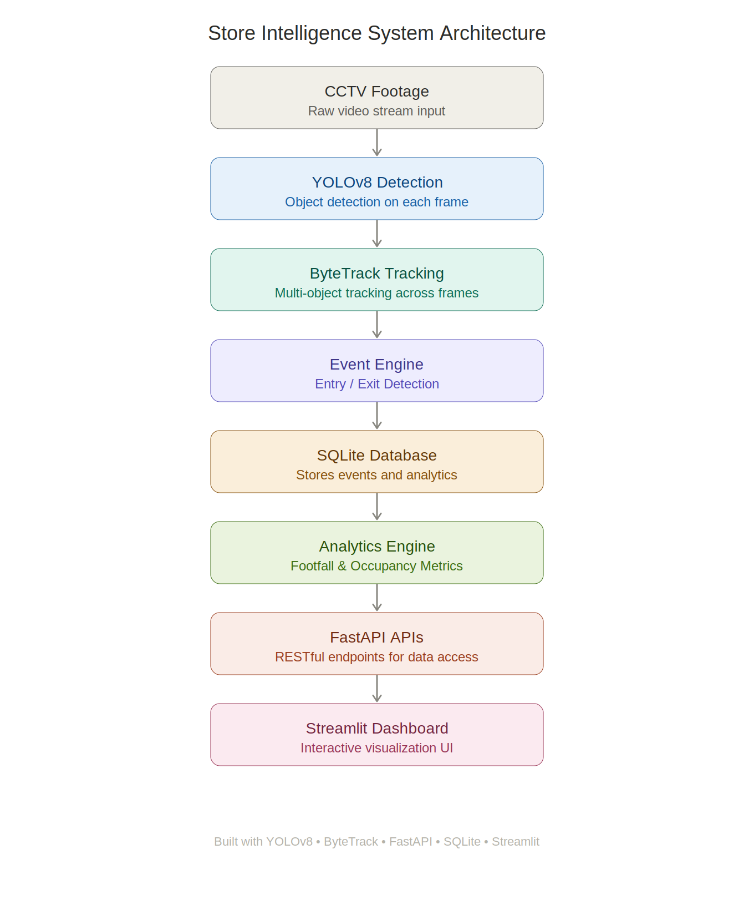

---

## Technology Stack

### AI & Computer Vision

* Python
* YOLOv8
* OpenCV
* ByteTrack

### Backend

* FastAPI
* Uvicorn

### Database

* SQLite

### Dashboard

* Streamlit
* Pandas

### Development Tools

* Git
* GitHub

---

## Project Structure

```text
store-intelligence/
│
├── analytics/
├── api/
├── config/
├── dashboard/
├── database/
├── detector/
├── docs/
├── events/
├── tracker/
├── tests/
│
├── main.py
├── requirements.txt
├── README.md
└── store.db
```

---

## Workflow

1. Video stream is processed frame by frame.
2. YOLOv8 detects people in the frame.
3. ByteTrack assigns unique IDs and tracks movement.
4. A virtual entry line is monitored.
5. Crossing the line generates Entry or Exit events.
6. Events are stored in SQLite.
7. Analytics are calculated from stored events.
8. FastAPI exposes analytics endpoints.
9. Streamlit dashboard visualizes store intelligence metrics.

---

## Dashboard

### Main Analytics Dashboard

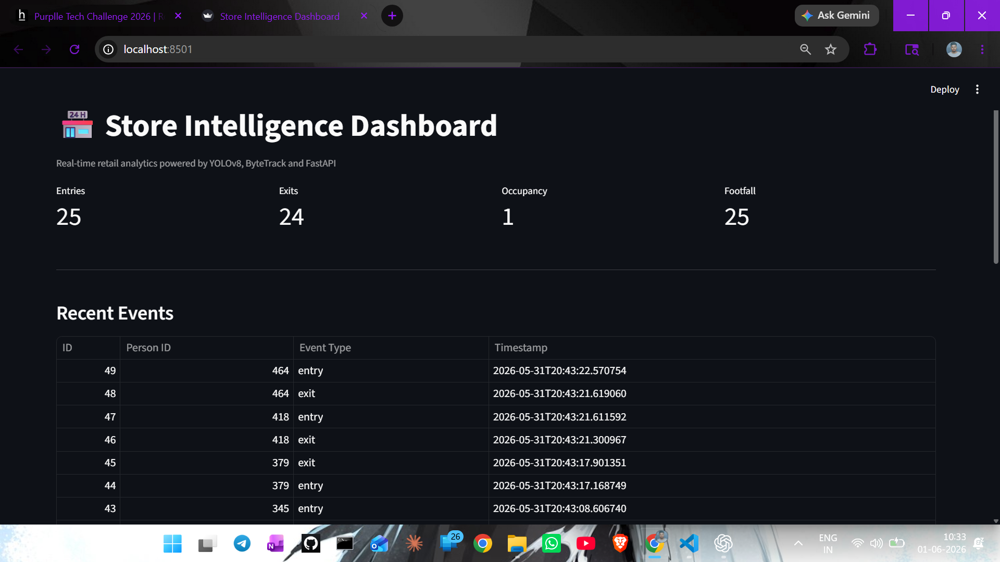

### Additional Dashboard Views

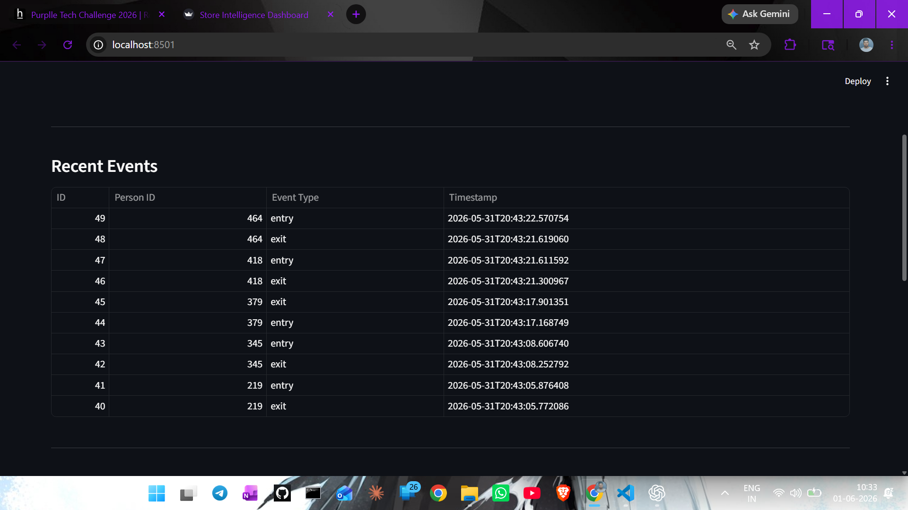

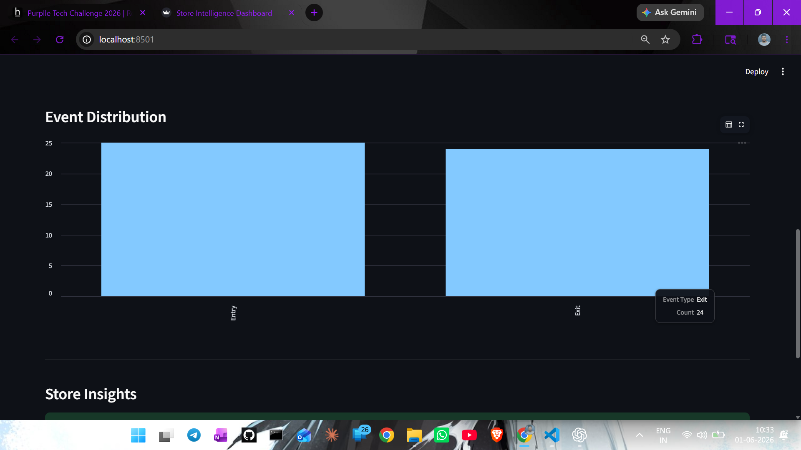

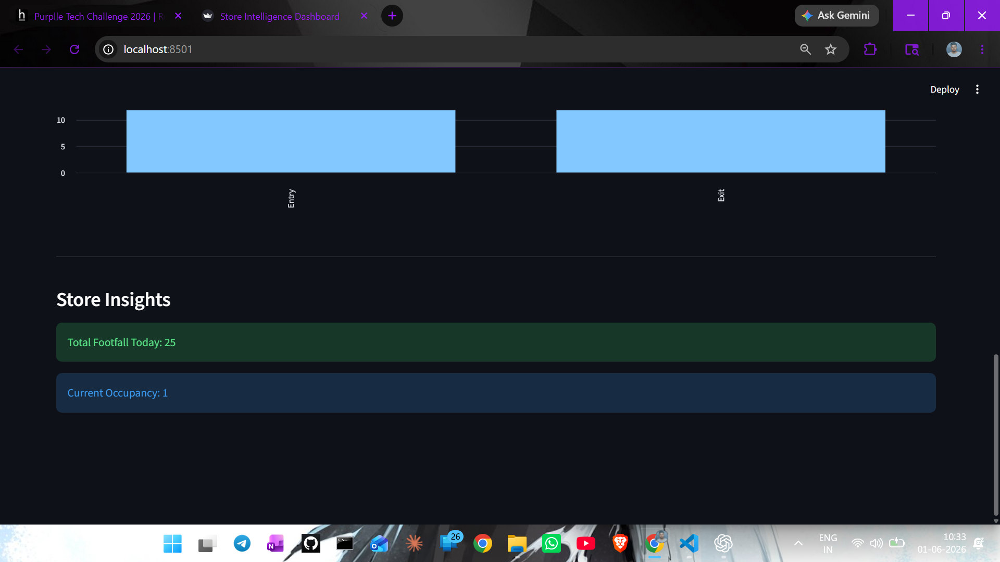

---

## Tracking Demo

The tracking engine detects and tracks customers in real time while calculating entries, exits, occupancy, and footfall.

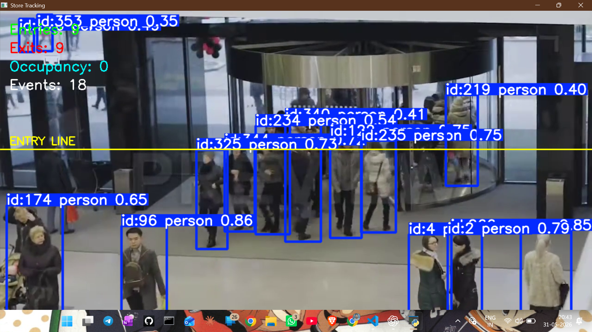

---

## FastAPI Documentation

### Swagger UI

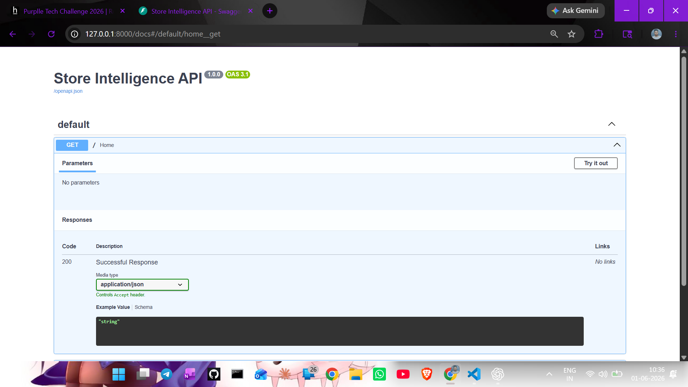

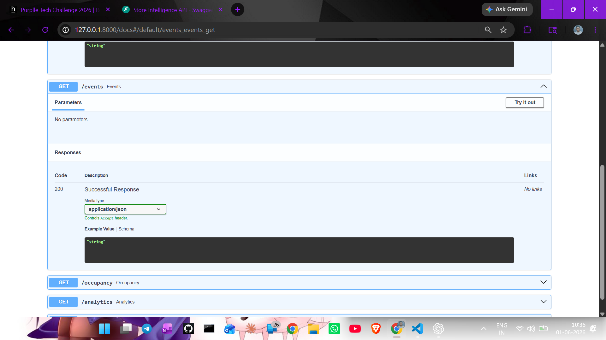

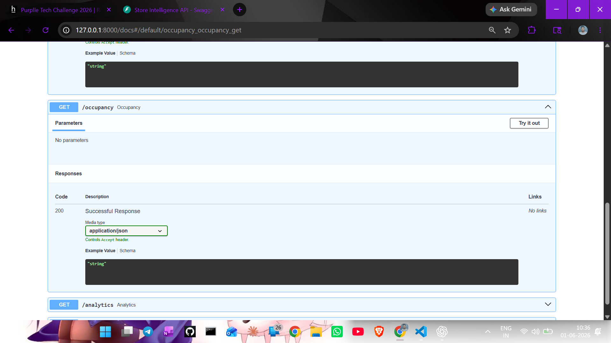

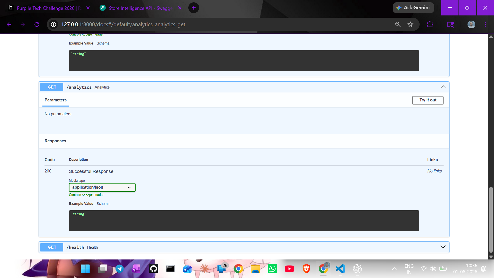

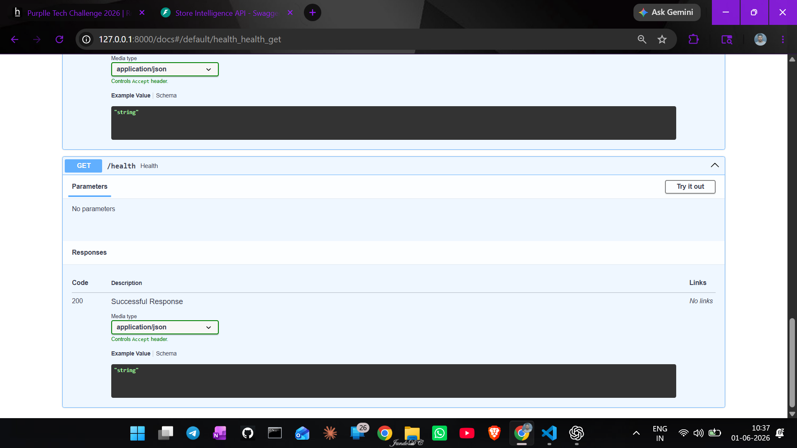

---

## API Endpoints

### Get Analytics

```http
GET /analytics
```

Response:

```json
{
  "entries": 13,
  "exits": 12,
  "occupancy": 1,
  "footfall": 13
}
```

---

### Get Occupancy

```http
GET /occupancy
```

Response:

```json
{
  "occupancy": 1
}
```

---

### Get Events

```http
GET /events
```

Returns all recorded entry and exit events.

---

## Installation

### Clone Repository

```bash
git clone https://github.com/Shivamjoshi902/store-intelligence.git
cd store-intelligence
```

### Create Virtual Environment

```bash
python -m venv venv
```

### Activate Virtual Environment

Windows:

```bash
venv\Scripts\activate
```

### Install Dependencies

```bash
pip install -r requirements.txt
```

---

## Run the Tracker

```bash
python -m tracker.tracker
```
Place CCTV video files in videos folder before running the tracker.

Example:
videos/store_sample.mp4

Video files are excluded from the repository as per challenge guidelines.

---

## Run FastAPI Server

```bash
uvicorn api.main:app --reload
```

API Documentation:

```text
http://127.0.0.1:8000/docs
```

---

## Run Dashboard

```bash
streamlit run dashboard/app.py
```

Dashboard:

```text
http://localhost:8501
```

---


## Demo Data

The deployed dashboard uses a small sample SQLite database to demonstrate analytics functionality.

Users can generate fresh analytics by running the tracker locally on their own CCTV footage.

_ _ _


## Future Enhancements

* Live CCTV stream support
* Multi-camera tracking
* Customer dwell-time analytics
* Heatmap generation
* Peak-hour analysis
* Cloud deployment
* Alerting and notification system
* Advanced business intelligence reports

---

## Use Cases

* Retail Store Analytics
* Shopping Malls
* Supermarkets
* Smart Stores
* Customer Traffic Analysis
* Occupancy Monitoring
* Business Intelligence Systems

---

## Author

**Shivam Joshi**

Purple Tech Challenge 2026 Submission

AI-Powered Store Intelligence System
